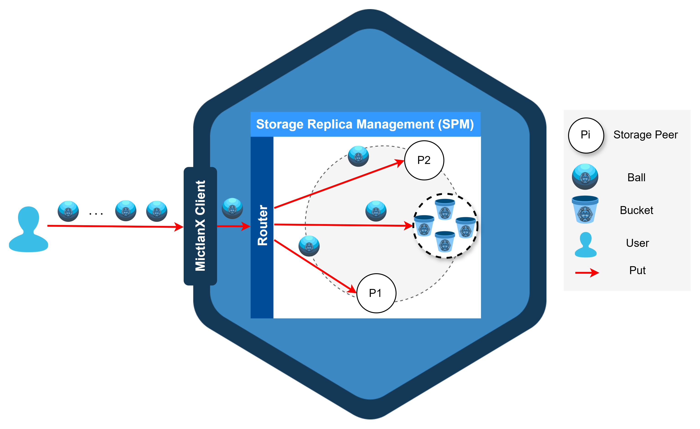

<p align="center">
  
</p>

<div align=center>
<a href="https://test.pypi.org/project/mictlanx/"></a>

</div>
<div align=center>
	<h1>MictlanX: <span style="font-weight:normal;">  Router </span></h1>
</div>

The **MictlanX Router** is the entrypoint service of the [MictlanX](https://github.com/muyal-ilal/mictlanx) ecosystem.  
It acts as a programmable router for **Virtual Storage Spaces (VSS)**, managing peers, buckets, caching, and replication across distributed storage peers.  


The Router is implemented in **Python 3.10+** with **FastAPI**, **Poetry**, and full **OpenTelemetry** instrumentation.

---

## ✨ Features

- **Peer Management** – discovery, registration, and routing across distributed peers.  
- **Bucket Management** – operations over buckets and stored objects (balls).  
- **Caching Layer** – pluggable cache with configurable eviction policies (`LRU_SM`, `LRU`, `LFU`, etc.).  
- **Observability** – integrated **OpenTelemetry** (OTLP/Jaeger/Grafana) + Prometheus instrumentation.  
- **Configuration via ENV** – runtime parameters defined entirely by environment variables.  
- **Extensible** – modular controllers (`peers`, `buckets`, `cache`) for future expansion.  
- **Deployment-Ready** – runs with `uvicorn`, `hypercorn`, or `gunicorn`.

---

## Architecture 🏗️

The **MictlanX Router** is the entrypoint for client requests in the MictlanX ecosystem.  
It manages communication between the **MictlanX Client**, a set of **Storage Peers**, and the **Storage Replica Management (SPM)** subsystem. Together, these elements constitute a **Virtual Storage Space (VSS)** — a logical, programmable abstraction of distributed storage.



---

### Components of a Virtual Storage Space

- **User**  
  Issues storage operations (e.g., `PUT`, `GET`) through the **MictlanX Client**.

- **MictlanX Client**  
  Encapsulates user operations into requests sent to the Router.

- **Router**  
  The **gateway** of the VSS. Its main responsibilities are:  
  - Managing the list of available **Storage Peers**.  
  - **Coordinating and choreographing replication, PUT, and GET operations**.  
  - Caching peer data and metadata locally to reduce calls to the SPM.  
  - Acting as the real-time I/O orchestrator between clients and peers.  

- **Storage Replica Management (SPM)**  
  A distributed subsystem responsible for the **global cluster state**. It provides:  
  - **Cluster information management**: keeps track of peer health and status.  
  - **Healing of storage peers**: detects failures and ensures data redundancy.  
  - **Distribution maps**: maintains authoritative mappings of Balls and Buckets across peers.  
  - **Metrics collection**: gathers usage and performance statistics to support load balancing and elastic decisions.  

- **Peers (P1, P2, …)**  
  Independent storage nodes that hold **Buckets** (logical containers) and **Balls** (atomic objects).

- **Router Cache**  
  Stores peer metadata, recent distribution decisions, and coordination data.  
  This enables the Router to **replicate and serve requests quickly**, even when SPM calls are avoided.

---

### Example Workflow (PUT Operation)

1. **User** requests to store a Ball.  
2. The **Client** sends the request to the **Router**.  
3. The **Router** consults the **SPM** for replica placement.  
4. Based on SPM metadata, the Router forwards the Ball to the appropriate **Peers**.  
5. The **Router Cache** stores this placement metadata for future requests.  
6. The Ball is stored inside a **Bucket** on the selected peers, completing the operation.  

---

### Key Ideas

- The **VSS** is the **logical unit of storage** in MictlanX.  
- **Router = entrypoint**, **SPM = metadata authority**, **Peers = data holders**.  
- **Caching in the Router** ensures performance and resilience.  
- Decoupling metadata (SPM) from I/O (Router/Peers) allows **elastic scaling and flexible replication strategies**.

## 🧾 Prerequisites

Before running the **MictlanX Router**, ensure the following requirements are met:

1. **Docker**  
   - Required to run supporting services such as Jaeger/Zipkin (for observability) or other MictlanX components.  
   - Install from [Docker official site](https://docs.docker.com/get-docker/).  

2. **Python 3.10+**  
   - The Router service is implemented in **Python 3.10** and above.  
   - Check your version with:  
     ```bash
     python3 --version
     ```

3. **Poetry**  
   - Used as the dependency and build manager.  
   - Install Poetry globally:  
     ```bash
     curl -sSL https://install.python-poetry.org | python3 -
     ```
   - Verify installation:  
     ```bash
     poetry --version
     ```

4. **(Optional) Poetry Shell**  
   - Recommended for development and testing.  
   - Spawns a virtual environment with all dependencies loaded:  
     ```bash
      poetry self add poetry-plugin-shell
     ```
5. Install jq :
	```
		sudo apt get jq
	```

5. **Docker Network: `mictlanx`**  
   - The Router expects peers and related services to be on the same custom Docker network.  
   - Create it once (if it doesn’t exist already):  
     ```bash
     docker network create mictlanx
     ```
   - This ensures that the Router, Summoner, and Peer containers can discover each other by hostname.  

---

✅ With these prerequisites in place, you are ready to build, run, and connect the **MictlanX Router** with the rest of the system.


## 📦 Installation

Clone the repo and install dependencies using **Poetry**:

```bash
git clone git@github.com:jub-ecosystem/mictlanx-service.git
cd mictlanx-service
poetry install
```
For development
```sh
poetry shell
```

## 🚀 Running the Router

Start with uvicorn:
```sh
chmod +x ./run_local.sh && ./run_local.sh
```

Or with Gunicorn:
```sh
chmod +x ./run_local_gunicorn.sh && ./run_local_gunicorn.sh
```
or with hypercorn:
```sh
chmod +x ./run_local_hcorn.sh && ./run_local_hcorn.sh
```

## ⚙ Configuration

The Router is fully configured through environment variables.
Below are the most important options (with defaults):

| Variable                          | Default                                          | Description                      |
| --------------------------------- | ------------------------------------------------ | -------------------------------- |
| `MICTLANX_ROUTER_SERVICE_NAME`    | `mictlanx-router`                                | Service identifier for telemetry |
| `MICTLANX_ROUTER_HOST`            | `localhost`                                      | Router bind host                 |
| `MICTLANX_ROUTER_PORT`            | `60666`                                          | Router bind port                 |
| `MICTLANX_CACHE`                  | `1`                                              | Enable/disable caching           |
| `MICTLANX_CACHE_EVICTION_POLICY`  | `LRU_SM`                                         | Cache eviction policy            |
| `MICTLANX_CACHE_CAPACITY`         | `100`                                            | Max number of entries            |
| `MICTLANX_CACHE_CAPACITY_STORAGE` | `1GB`                                            | Max cache storage                |
| `MICTLANX_ROUTER_OPENTELEMETRY`   | `1`                                              | Enable/disable tracing           |
| `MICTLANX_JAEGER_ENDPOINT`        | `http://localhost:4318`                          | Jaeger OTLP endpoint             |
| `MICTLANX_ZIPKIN_ENDPOINT`        | `http://localhost:9411`                          | Zipkin endpoint                  |
| `MICTLANX_ROUTER_MAX_PEERS`       | `10`                                             | Max peer connections             |
| `MICTLANX_ROUTER_MAX_TTL`         | `3`                                              | Max hop TTL                      |
| `MICTLANX_ROUTER_MAX_CONCURRENCY` | `5`                                              | Max concurrent replication tasks |
| `MICTLANX_SUMMONER_IP_ADDR`       | `localhost`                                      | Summoner service host            |
| `MICTLANX_SUMMONER_PORT`          | `15000`                                          | Summoner service port            |
| `MICTLANX_SUMMONER_SUBNET`        | `10.0.0.0/25`                                    | Summoner subnet                  |
| `MICTLANX_PEERS_URI`              | `mictlanx://mictlanx-peer-0@localhost:24000,...` | Initial peer list                |


## 📡 API & Controllers

The Router exposes a **FastAPI** service with three main controllers:

### **PeersController**
- Handles **peer registration, listing, and status**.  
- **Endpoint prefix:** `/peers`

### **BucketsController**
- Manages **buckets and balls** (logical storage objects).  
- **Endpoint prefix:** `/buckets`

### **CacheController**
- Provides access to **inspect and control the local Router cache**.  
- **Endpoint prefix:** `/cache`

---

### 📖 Interactive Documentation

- **Swagger UI** → [http://localhost:60666/docs](http://localhost:60666/docs)  
- **ReDoc** → [http://localhost:60666/redoc](http://localhost:60666/redoc)

## 📊 Observability

MictlanX Router ships with **observability out of the box**. Traces and metrics are enabled via env vars and a helper script.

### What you get
- **OpenTelemetry tracing** (enabled by default)
  - **OTLP (Jaeger-compatible) exporter** → `MICTLANX_JAEGER_ENDPOINT`
  - **Zipkin exporter** → `MICTLANX_ZIPKIN_ENDPOINT`
  - **Console exporter** (only when `MICTLANX_DEBUG=1`)
- **Prometheus metrics** via `prometheus-fastapi-instrumentator`
  - Default scrape endpoint: `GET /metrics`
  
### Default UI Ports

- **Jaeger UI** → [http://localhost:16686](http://localhost:16686)  
- **Prometheus UI** → [http://localhost:9090](http://localhost:9090)  
- **Grafana UI** → [http://localhost:3000](http://localhost:3000)  

**Default credentials (Grafana):**  
- **Username:** `admin`  
- **Password:** `admin`  


---

### One-command local stack
Use the provided script to bring up tracing backends:

```bash
chmod +x ./run_opentelemetry.sh && ./run_opentelemetry.sh
```


## Docker Image Building 🐋
```sh
chmod +x ./build.sh && ./build.sh <TAG>
```

## Deploying
```sh
docker compose -f mictlanx-router.yml up -d 
```

## A shortcut
```sh
chmod +x ./deploy.sh && ./deploy.sh
```
## 🔒 Generating Certificates for HTTPS

To run the MictlanX Router with HTTPS using **FastAPI + Hypercorn**, you need a private key and a certificate in PEM format.  
You can generate self-signed ones for local testing with **OpenSSL**:

```sh
# Generate private key
openssl genrsa -out test_key.pem 2048

# Generate certificate signing request (CSR)
openssl req -new -key test_key.pem -out test_csr.pem

# Generate self-signed certificate valid for 365 days
openssl x509 -req -days 365 -in test_csr.pem -signkey test_key.pem -out test_cert.pem
```
This produces:

- test_key.pem → private key

- test_cert.pem → public certificate

## Running hypercorn with HTTPS
```
hypercorn mictlanxrouter.server:app \
  --bind 0.0.0.0:60666 \
  --certfile=./test_cert.pem \
  --keyfile=./test_key.pem

```


## 🧪 Testing

Unit and integration tests are included under the `tests/` directory to validate all Router endpoints (`PeersController`, `BucketsController`, and `CacheController`).

### ⚠️ Important

> **The tests require that the MictlanX Replica Manager (`mictlanx-rm`) service is running locally.**
> Without it, several endpoints that depend on the `SPMClient` (such as `/api/v4/peers`, `/api/v4/buckets`, and `/api/v4/cache`) will fail to connect and return errors (e.g., 500 or “No available peers”).

Ensure that **`mictlanx-rm`** is running in your local environment before executing any tests.

For example:

```bash
cd ~/Cinvestav/mictlanx-rm
poetry run ./run_local.sh
```

Once `mictlanx-rm` is active, you can safely run the tests for the Router.

---

### 🧰 Run all tests

Execute all unit tests with verbose output:

```bash
poetry run pytest -s -v tests/
```

---

### 📈 Run with Coverage

To measure test coverage and generate a report:

```bash
poetry run coverage erase
poetry run coverage run -m pytest -s -v tests/
poetry run coverage report -m
```

This will display coverage results directly in the terminal.
You can also generate an HTML report for visualization:

```bash
poetry run coverage html
xdg-open htmlcov/index.html   # or open htmlcov/index.html manually
```

---

### 🧩 Test Structure

| File                                | Description                                                       |
| ----------------------------------- | ----------------------------------------------------------------- |
| `tests/test_peers_controller.py`    | Tests for `/api/v4/peers` and `/api/v4/xpeers` endpoints.         |
| `tests/test_buckets_controller.py`  | Tests for `/api/v4/buckets` operations (metadata, data, delete).  |
| `tests/test_cache_controller.py`    | Tests for `/api/v4/cache` and `/api/v4/cache/reset`.              |

---

### ✅ Example Successful Output

```text
================================================= test session starts ==================================================
platform linux -- Python 3.10.16, pytest-8.4.2
collected 18 items

tests/test_peers_controller.py ........
tests/test_buckets_controller.py ......
tests/test_cache_controller.py ...
================================================== 18 passed in 2.34s ==================================================
```

---

### 🧭 Troubleshooting

If tests fail with messages such as:

```
GET.SPM.CLIENT.FAILED - Connection refused
```

Make sure that:

* The **MictlanX Replica Manager** (`mictlanx-rm`) is running locally.
* It is reachable at the default address and port (`localhost:5555`).
* Environment variables like `MICTLANX_DAEMON_HOSTNAME` and `MICTLANX_DAEMON_PORT` are correctly set.


## Contributing

Contributions are what make the open source community such an amazing place to learn, inspire, and create. Any contributions you make are **greatly appreciated**.

If you have a suggestion that would make this better, please fork the repo and create a pull request. You can also simply open an issue with the tag "enhancement".
Don't forget to give the project a star! Thanks again!

1. Fork the Project
2. Create your Feature Branch (`git checkout -b feature/AmazingFeature`)
3. Commit your Changes (`git commit -m 'Add some AmazingFeature'`)
4. Push to the Branch (`git push origin feature/AmazingFeature`)
5. Open a Pull Request

<p align="right">(<a href="#top">back to top</a>)</p>


<!-- LICENSE -->
## License

Distributed under the MIT License. See `LICENSE.txt` for more information.

<p align="right">(<a href="#top">back to top</a>)</p>


<!-- CONTACT -->
## Contact

 Ignacio Castillo - [@NachoCastillo]() - jesus.castillo.b@cinvestav.mx

<p align="right">(<a href="#top">back to top</a>)</p>
